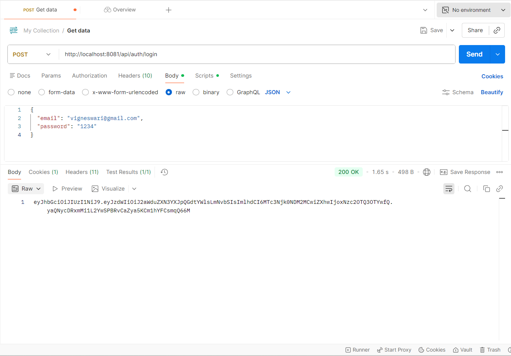
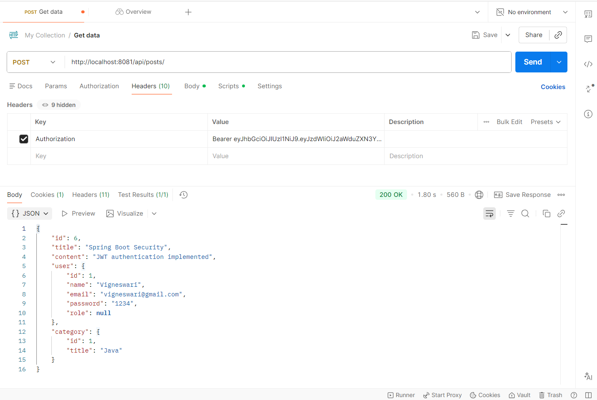
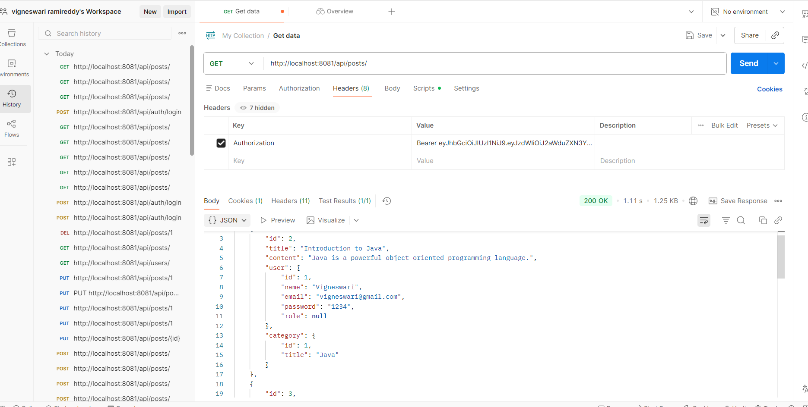
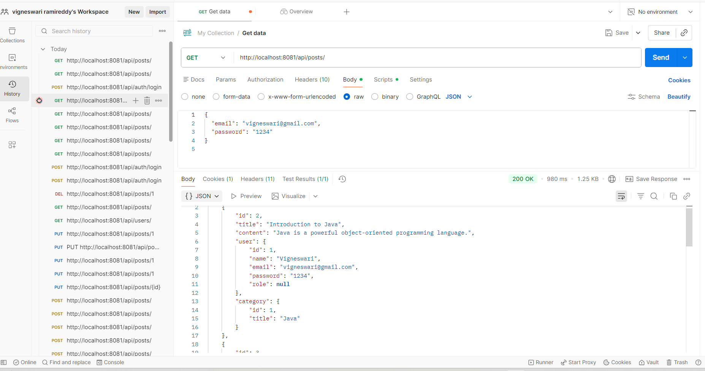
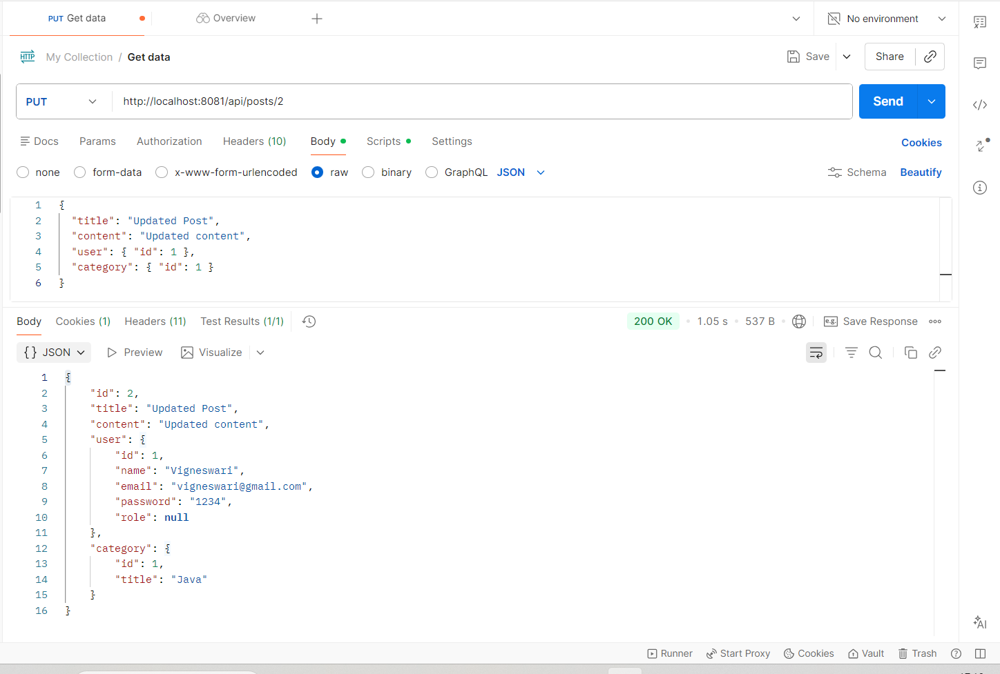
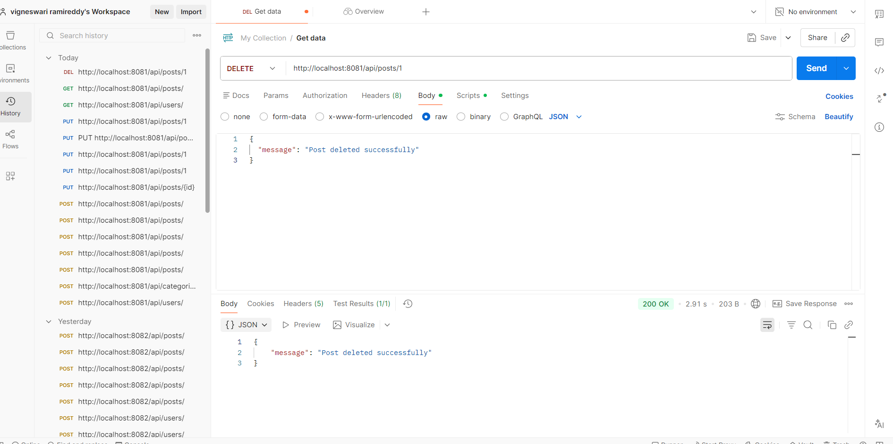
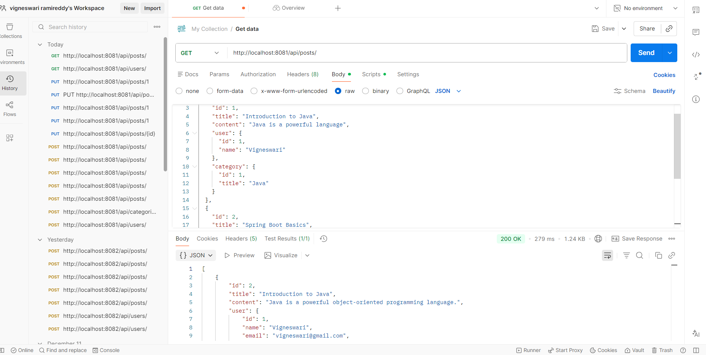
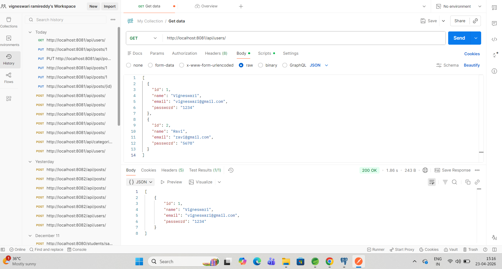
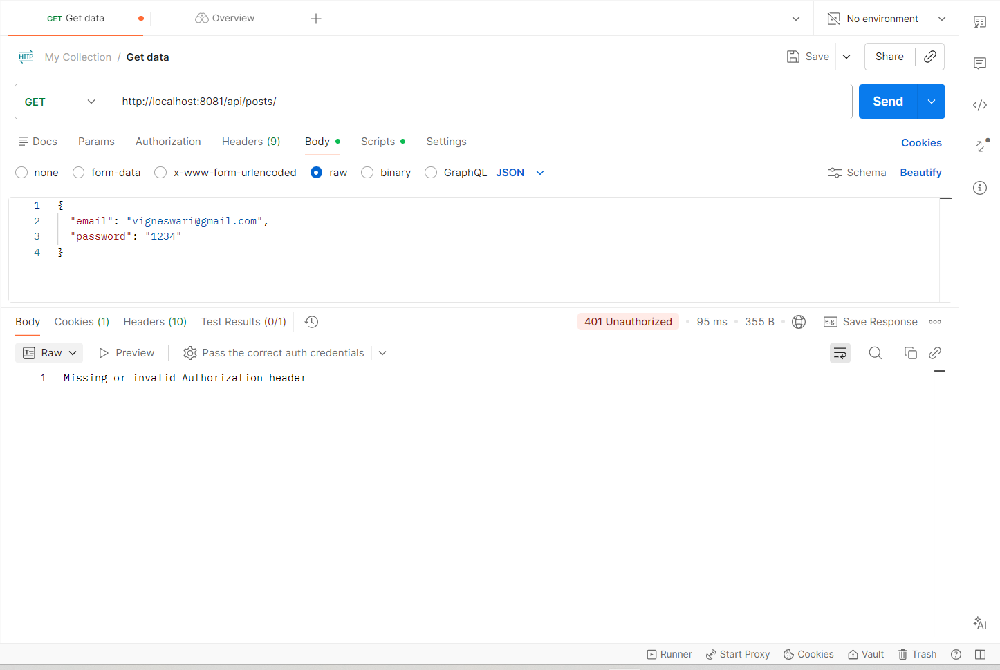

# Blogging Application (Java Full Stack Project)

##  Project Description

This is a **full-stack Blogging Application** developed using **Java and Spring Boot**.
It allows users to perform complete **CRUD operations** on blog posts with secure authentication and authorization.

The project demonstrates real-world backend development concepts like REST APIs, layered architecture, and security handling.

---

## Key Highlights

*  Secure Login & Authentication
*  Create, Update, Delete Blog Posts
*  Fetch All Posts & Individual Post
*  Unauthorized Access Handling
*  RESTful API Design
*  Database Integration

---

##  Tech Stack

* **Backend:** Java, Spring Boot
* **Database:** MySQL
* **Tools:** Postman, Maven
* **Architecture:** REST API, MVC Pattern

---

##  Screenshots

###  User Login (JWT Token Generation)



---

###  Create Post (POST API)



---

###  Get All Posts (GET API)



---

###  Get Single Post by ID



---

###  Update Post (PUT API)



---

###  Update Post (Detailed Request & Response)


---

###  Delete Post (DELETE API)



---

###  Get Posts (Alternate View)



---

###  Get Users (Admin Access)



---

###  Unauthorized Access (Without Token)



---
## ⚙️ How to Run

### 1️. Clone Repository

```bash
git clone https://github.com/Ramireddyvigneswari/blogging-application.git
```

### 2️. Navigate to Project

```bash
cd blogging-application
```

### 3️. Configure Database

Update `application.properties`:

```properties
spring.datasource.url=jdbc:mysql://localhost:5432/blog_app
spring.datasource.username=root
spring.datasource.password=postgresql123
```

### 4️. Run Application

```bash
mvn spring-boot:run
```
------

##  API Endpoints

| Method | Endpoint    | Description     |
| ------ | ----------- | --------------- |
| POST   | /login      | User login      |
| POST   | /posts      | Create post     |
| GET    | /posts      | Get all posts   |
| GET    | /posts/{id} | Get single post |
| PUT    | /posts/{id} | Update post     |
| DELETE | /posts/{id} | Delete post     |

---
##  Architecture

The application follows a layered architecture:

* **Controller Layer** → Handles HTTP requests and responses
* **Service Layer** → Contains business logic
* **Repository Layer** → Interacts with the database using JPA

---

##  Security

* Implemented authentication for users
* Restricted unauthorized access to protected APIs

---

##  Improvements Implemented

* Exception handling for API errors
* Input validation for requests
* Structured REST API responses

---

##  What I Learned

* Building REST APIs using Spring Boot
* Handling authentication & authorization
* Structuring scalable backend applications
* Database integration using JPA/Hibernate
* API testing using Postman

---
##  Future Enhancements

* JWT-based authentication
* Pagination for posts
* Frontend integration (React)
* Deployment on cloud
----

##  Author

Vigneswari Ramireddy 

---

##  Future Improvements

* Add frontend (React/Angular)
* Implement JWT Authentication
* Deploy on cloud (AWS/Render)

---

⭐ If you like this project, consider giving it a star!
